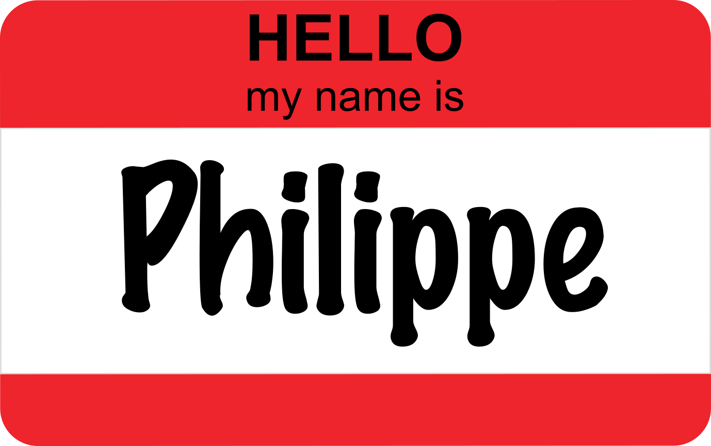
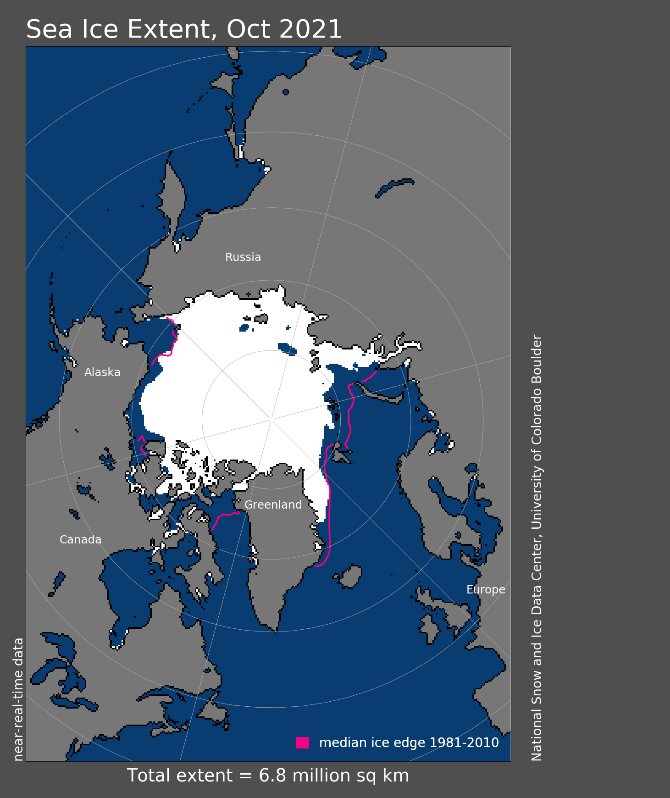
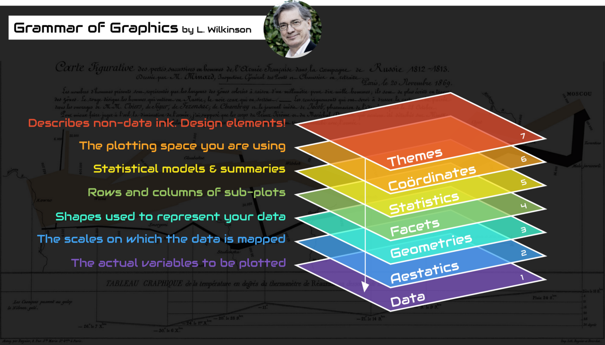
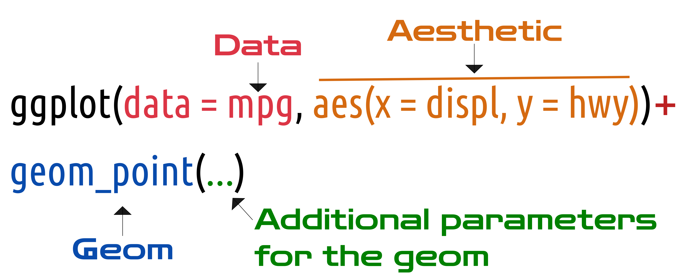

<!-- https://evamaerey.github.io/flipbooks/flipbook_recipes#49 -->

```{r setup, include=FALSE}
knitr::opts_chunk$set(
  echo = TRUE,
  dev = "svg",
  message = FALSE,
  cache = TRUE,
  fig.align = "center",
  fig.height = 4
)

knitr::knit_hooks$set(crop = knitr::hook_pdfcrop)

options(htmltools.dir.version = FALSE, warn = -1)

# names(xaringan:::list_css())

# devtools::install_github("rstudio/fontawesome")
library(tidyverse)
library(ggpmthemes)
library(patchwork)
library(flipbookr)
library(fontawesome)
library(palmerpenguins)
library(sf)
library(rnaturalearth)

theme_set(theme_light_modified(base_family = "Montserrat"))

theme_update(
  panel.border = element_blank()
)

htmltools::tagList(rmarkdown::html_dependency_font_awesome())
```

```{r xaringanExtra, echo=FALSE}
xaringanExtra::use_xaringan_extra(
  c(
    "tile_view",
    "animate_css",
    "tachyons"
  )
)
xaringanExtra::use_broadcast()
# xaringanExtra::use_clipboard()
# xaringanExtra::use_share_again()

```

```{r xaringanExtra-clipboard, echo=FALSE}
htmltools::tagList(
  xaringanExtra::use_clipboard(
    button_text = "<i>Copy</i>",
    success_text = "<i class=\"fa fa-check\" style=\"color: #90BE6D\"></i>",
    error_text = "<i class=\"fa fa-times-circle\" style=\"color: #F94144\"></i>"
  ),
  rmarkdown::html_dependency_font_awesome()
)
```

```{r xaringan-animate-all, echo=FALSE}
# xaringanExtra::use_animate_all("fade")
xaringanExtra::use_tachyons()
# xaringanExtra::use_text_poster()
```

class: title-slide, center, bottom

# `r rmarkdown::metadata$title`

### *`r rmarkdown::metadata$subtitle`*


January 26, 2022 (updated: `r Sys.Date()`)

## `r rmarkdown::metadata$author`

---

<br>

<center></center>

<p align="left">

<b>Research assistant at Takuvik (Laval University)</b><br>

- Remote sensing, modelling, data science, data visualization<br>

<br>

`r fontawesome::fa("github", fill = "#3C3C3C", height = "20px")` <small>https://github.com/PMassicotte</small> <br>

`r fontawesome::fa("envelope", fill = "#3C3C3C", height = "20px")` <small>philippe.massicotte@takuvik.ulaval.ca</small> <br>

`r fontawesome::fa("twitter", fill = "#3C3C3C", height = "20px")` <small>@philmassicotte</small> <br>

`r fontawesome::fa("blog", fill = "#3C3C3C", height = "20px")` <small>www.pmassicotte.com</small>

</p>

---

# Outline

- What is data visualization?

- `ggplot2` basic plots
    - Histograms and bar plots
    - Points and lines plots
    - Boxplots

- `ggplot2` aesthetics and appearance
    - Color, size
    - Axes and titles
    - Faceting (small multiples)
    - Overview of the `theme()` function

- Combining plots with `patchwork`

- Exporting `ggplot2` graphics

---

# Data visualization

<center>
<figure>
  
<figcaption>Artwork by <a href="https://twitter.com/allison_horst?s=20">@allison_horst</a></figcaption>
</figure>
</center>

---

# Data visualization

--

- Important aspect of data sciences:
    - **Communicate information clearly and efficiently to the community.**

--

- Powerful tool to discovers patterns in the data:
    - It makes complex data more accessible: **reveal the data**.

--

- Bad graphics can be a reason for paper rejection:
    - **Readers should rapidly understand the message you are trying to convey.**

--

- A picture is worth a thousand words:
    - **Always, always, always plot your data!**
    - When possible, replace tables with more compelling figures.

---

# Visualization to convey your message

It is difficult to grasp the information contained in a table.

.pull-left[
```{r, echo = FALSE}
file <- "ftp://sidads.colorado.edu/DATASETS/NOAA/G02135/north/daily/data/N_seaice_extent_daily_v3.0.csv"

raw_data <- curl::curl_fetch_memory(file)

sea_ice_extent <- rawToChar(raw_data$content)

sea_ice_extent <- sea_ice_extent %>%
  read_csv(
    skip = 2,
    col_names = c("year", "month", "day", "extent", "missing", "source")
  ) %>%
  dplyr::select(year:extent) %>%
  mutate(month = parse_number(month)) %>%
  mutate(month2 = month.name[month]) %>%
  mutate(month2 = factor(month2, month.name))

sea_ice_extent %>%
  head(10) %>%
  transmute(date = lubridate::make_date(year, month, day), extent) %>%
  knitr::kable(caption = "Sea ice extent in the Arctic between 1978 and 2021.") %>%
  kableExtra::kable_styling(font_size = 18, full_width = TRUE) %>%
  kableExtra::column_spec(column = 1:2, width = "3in")
```
]

.pull-right[
<center>
    
</center>
]

---

# Visualization to convey your message

Graphics, on the other hand, help to convey your message.

```{r, echo = FALSE, fig.width = 10, fig.height=6, out.width="70%"}

sea_ice_extent %>%
  group_by(month2, year) %>%
  summarise(extent = mean(extent)) %>%
  ggplot(aes(x = year, y = extent)) +
  geom_point(color = "#5c5c5c", size = 2) +
  facet_wrap(~month2, scales = "free_y") +
  geom_smooth(method = "lm", se = FALSE) +
  xlab(NULL) +
  ylab(bquote("Sea ice extent" ~ (km^2 %*% 10^6))) +
  labs(
    title = sprintf(
      "Arctic sea ice extent between %d and %d",
      min(sea_ice_extent$year),
      max(sea_ice_extent$year)
    ),
    caption = paste("Source:", file)
  ) +
  theme(
    plot.caption = element_text(size = 8, color = "gray50"),
    plot.margin = unit(c(5.5, 10, 5.5, 5.5), "points"),
    strip.background = element_blank(),
    strip.text = element_text(face = "bold", size = 14, hjust = 0),
    axis.ticks = element_blank()
  )
```


---

# Datasaurus Dozen

```{r, echo = FALSE}
# devtools::install_github("lockedata/datasauRus")
library(datasauRus)

datasaurus_dozen %>%
  ggplot(aes(x, y, color = dataset)) +
  geom_point(show.legend = FALSE) +
  facet_wrap(~dataset, ncol = 5) +
  labs(
    x = NULL,
    y = NULL
  ) +
  theme(
    strip.background = element_blank(),
    panel.border = element_blank(),
    axis.ticks = element_blank()
  )
```

--

**These 13 datasets have the same statistical properties (*mean*, *variance*, *correlation*).** However, they look quite different!


---

# Different types of visualizations

There are many types of visualization to chose from to present data. The decision depends on the data itself and how you want to present it to your audience.

<center>
    
    <figcaption>
    <a href="https://www.kdnuggets.com/2019/03/how-choose-right-chart-type.html">How to Choose the Right Chart Type</a>
    </figcaption>
</center>

---

class: inverse, center, middle

<center>
<figure>
  
<figcaption>Artwork by <a href="https://twitter.com/allison_horst?s=20">@allison_horst</a></figcaption>
</figure>
</center>

---

# ggplot2

`ggplot2` is a system for declaratively creating graphics, based on [The Grammar of Graphics](https://amzn.to/2ef1eWp).

> Presents a unique foundation for producing almost every quantitative graphic found in scientific journals, newspapers, statistical packages, and data visualization systems.

<center>
<figure>
  
<figcaption>Source: <a href="https://bit.ly/3JwHavs">Thomas de Beus</a></figcaption>
</figure>
</center>

---

# ggplot2

`ggplot2` is not part of base R, so it needs to be installed.

.left-column[
<center>
<figure>
  
</figure>
</center>
]

.right-column[

```{r, eval = FALSE}
install.packages("ggplot2")
```

After the installation, you will have to load it.

```{r, eval = FALSE}
library(ggplot2)
```
]

---

# ggplot2

.column-left[
- `ggplot2` is a very powerful tool. 

- The learning curve can be difficult, but **the time investment will eventually pay off.**
]

.column-right[
<center>
<figure>
  
    <figcaption>
    Artwork by <a href="https://twitter.com/allison_horst?s=20">@allison_horst</a>
    </figcaption>
</figure>
</center>
]

---

# TidyTuesday

TidyTuesday is a weekly challenge where people use (mostly) `ggplot2` to explore a new dataset.

> A weekly data project aimed at the R ecosystem. As this project was borne out of the R4DS Online Learning Community and the R for Data Science textbook, an emphasis was placed on understanding how to summarize and arrange data to make meaningful charts with `ggplot2`, `tidyr`, `dplyr`, and other tools in the `tidyverse` ecosystem.

<center>
    
    <figcaption>
    <a href="https://twitter.com/search?q=%23TidyTuesday&src=hashtag_click">#TidyTuesday on <i class="fab fa-twitter"></i></a>
    </figcaption>
</center>

---

# TidyTuesday

As already said, `ggplot2` can be intimidating at first. However, with some practice, you will be able to make stunning graphics.

<div class="row">
    <div class="column">
        
        <figcaption>
            Graphic by <a href=https://twitter.com/ChBurkhart">@ChBurkhart</a>
        </figcaption>
    </div>
    <div class="column">
        
        <figcaption>
            Graphic by <a href=https://twitter.com/jakekaupp">@jakekaupp</a>
        </figcaption>
    </div>
    <div class="column">
        
        <figcaption>
            Graphic by <a href=https://twitter.com/geokaramanis?lang=en">@geokaramanis</a>
        </figcaption>
    </div>
</div>

**Most people participating in the TidyTuesday challenges share their code on Github. It is a great way to learn more advanced techniques!**

---

class: inverse, center, middle

# Let's start with ggplot2!

---

# The Palmer Penguins

Data were collected and made available by [Dr. Kristen Gorman](https://www.uaf.edu/cfos/people/faculty/detail/kristen-gorman.php) and the [Palmer Station, Antarctica LTER](https://pal.lternet.edu/), a member of the [Long Term Ecological Research Network](https://lternet.edu/). 

<center>
<figure>
  
</figure>
<figcaption>
    Artwork by <a href="https://twitter.com/allison_horst?s=20">@allison_horst</a>
</figcaption>
</center>

---

# The Palmer Penguins

The dataset contain data for 344 penguins from 3 different species (<pu><b>Chinstrap</b></pu>, <cy><b>Gentoo</b></cy> and <or><b>Adélie</b></or>) collected from 3 islands in the Palmer Archipelago, Antarctica.

<small>
.pull-left[

- `species`: penguin species (Adélie, Chinstrap and Gentoo)

- `island`: island in Palmer Archipelago, Antarctica (Biscoe, Dream or Torgersen)

- `bill_length_mm`: bill length (millimeters)

- `bill_depth_mm`: bill depth (millimeters)

- `flipper_length_mm`: flipper length (millimeters)

- `body_mass_g`: body mass (grams)

- `sex`: penguin sex (female, male)

- `year`: year of the study (2007, 2008 or 2009)

]
</small>

.pull-right[
<center>
<figure>
  
</figure>
</center>
]

---

# Installing the data

.left-column[
<center>
<figure>
  
</figure>
</center>
]

.right-column[
You can install the data as follow:

```{r, eval = FALSE}
# install.packages("remotes")
remotes::install_github("allisonhorst/palmerpenguins")
```
]

---

# Exploring the penguins data

<small>
```{r}
library(palmerpenguins)
penguins
```
</small>

---

# Understanding the ggplot2 syntax

A `ggplot2` plot is built layer by layer by using the `+` operator. 

<center>
    
</center>
<figcaption>
    The basic structure of a ggplot2 plot.
</figcaption>
        
---

# The geoms 

`geoms` is the abbreviation for *geometric objects* which are used to specify which type of graphic you want to produce (boxplot, barplot, scatter, ...). All `ggplot2` geoms start with the `geom_` prefix.

<small>
```{r, echo = FALSE}
ls(pattern = "^geom_", env = as.environment("package:ggplot2"))
```
</small>

---

class: inverse, center, middle

# One variable graphics

---

# One variable graphics

In this section, we are going to see the two main types of one variable graphics:

| **Graphic type** | **Geom**           | **Description**                          |
| ---------------- | ------------------ | ---------------------------------------- |
| Histogram        | `geom_histogram()` | Produces histograms for continuous data. |
| Barplot          | `geom_bar()`       | Produces histograms for discrete data.   |


```{r histogram1, include = FALSE, warning=FALSE}
ggplot(
  data = penguins,
  mapping = aes(x = body_mass_g)
) +
  geom_histogram()
```

---

`r chunk_reveal(chunk_name = "histogram1", title = "# Histogram")`

---

```{r barplot1, include=FALSE}
ggplot(
  data = penguins,
  mapping = aes(x = island)
) +
  geom_bar()
```

`r chunk_reveal(chunk_name = "barplot1", title = "# Barplot")`

---

class: inverse, center, middle

# Two variables graphics

---

# Two variables graphics

There are several types of charts with two variables. Here are the most used.

| **Graphic type** | **Geom**         | **Description**                                               |
| ---------------- | ---------------- | ------------------------------------------------------------- |
| Barplot          | `geom_col()`     | Produces bars with heights that represent values in the data. |
| Scatter plot     | `geom_point()`   | Produces scatter plot between `x` and `y`.                    |
| Line plot        | `geom_line()`    | Produces line plot between `x` and `y`.                       |
| Boxplot          | `geom_boxplot()` | Boxplot between `x` and `y`.                                  |

---

# Barplot

We used `geom_bar()` to visualize the number/count of cases for each value of `x`. If we want to represent values in the data (`y`), we can use `geom_col()`. For this example, I will use the `starwars` data that is included in the `dplyr` package. **This graph shows the top 20 tallest characters (in cm).**

```{r, echo=FALSE}
sw <- starwars %>% 
  slice_max(height, n =  20)
```

.pull-left[
```{r barplot2, eval=FALSE}
ggplot(
  data = sw,
  mapping = aes(
    x = name,    #<<
    y = height   #<<
  )
) +
  geom_col()
```
]

.pull-right[
```{r ref.label="barplot2", echo=FALSE}

```
]

--

**What is wrong with this graph?**

---

# Barplot

In the previous graph, it was difficult to read the names on the `x` axis. **A better way to present the data is by swapping the `x` and `y` axes.**

--

.pull-left[
```{r barplot3, eval=FALSE}
ggplot(
  data = sw,
  mapping = aes(
    x = height,  #<<
    y = name     #<<
  )
) +
  geom_col()
```
]

.pull-right[
```{r ref.label="barplot3", echo=FALSE}

```
]

---

# Ordering things

We have made some improvements in the previous graph by swapping the axes. However, **it would be even better if the characters were sorted by their height** to make the plot easier to understand. 

--

One way to do it is with `forcats::fct_reorder()`. Note that the `forcats` library is not part of base R and must be installed separately.

--

.pull-left[
<small>
```{r barplot4, eval=FALSE}
ggplot(
  data = sw,
  mapping = aes(
    x = height,
    y = forcats::fct_reorder(name, height)  #<<
  )
) +
  geom_col()
```
</small>
]

--

.pull-right[
```{r ref.label="barplot4", echo=FALSE}

```
]

---

```{r scatterplot1, include = FALSE}
ggplot(
  penguins,
  aes(
    x = bill_length_mm,
    y = body_mass_g
  )
) +
  geom_point()
```

`r chunk_reveal(chunk_name = "scatterplot1", title = "# Scatter plot")`

---

```{r lineplot1, include = FALSE}
ggplot(
  penguins,
  aes(
    x = bill_length_mm,
    y = body_mass_g
  )
) +
  geom_line()
```

`r chunk_reveal(chunk_name = "lineplot1", title = "# Line plot")`

---

# Boxplot

> In descriptive statistics, a box plot or boxplot is a convenient way of graphically depicting groups of numerical data through their quartiles (Wikipedia).

To make a boxplot, we need to have a **discrete/categorical** variable on `x` and a **continuous** variable on `y`.

---

```{r boxplot1, include = FALSE}
ggplot(
  data = penguins,
  mapping = aes(
    x = island,
    y = body_mass_g
  )
) +
  geom_boxplot()
```

`r chunk_reveal(chunk_name = "boxplot1", title = "# Boxplot")`

---

# Boxplot

We can reorder the `island` variable based on the `body_mass_g` variable to make the graphic more appealing with `forcats::fct_reorder()`.

--

.pull-left[
<small>
```{r boxplot-ordered, eval=FALSE}
ggplot(
  data = penguins,
  mapping = aes(
    x = forcats::fct_reorder( #<<
      island, #<<
      body_mass_g, #<<
      na.rm = TRUE #<<
    ), #<<
    y = body_mass_g 
  )
) +
  geom_boxplot()
```
</small>
]

--

.pull-right[
```{r ref.label="boxplot-ordered", echo=FALSE}

```
]

---

class: inverse, center, middle

# Geom aesthetics

---

# Geom aesthetics

Aesthetics such as *color*, *shape*, *size* of the displayed geoms can be controlled inside the `geom_()` functions. For example, we can change the `color` and the `size` of the point in the `geom_point()` function.

```{r eval = FALSE}
geom_point(color = "red", size = 5) # All points will be red
```

```{r, echo = FALSE, fig.height = 3.5, fig.width = 6}
ggplot(
  penguins,
  aes(
    x = bill_length_mm,
    y = body_mass_g
  )
) +
  geom_point(color = "red", size = 5)
```

---

# Working with colors

If we want to set a color **based on a variable**, we have to use the aesthetic: `aes(colour = variable)`.

```{r, fig.height = 3.5}
ggplot(penguins, aes(x = bill_length_mm, y = body_mass_g)) +
  geom_point(aes(color = species)) #<<
```

---

```{r manual_colors1, include = FALSE}
ggplot(
  penguins,
  aes(
    x = bill_length_mm,
    y = body_mass_g
  )
) +
  geom_point(aes(color = species)) +
  scale_color_manual(
    breaks = c(
      "Adelie",
      "Chinstrap",
      "Gentoo"
    ),
    values = c(
      "darkorange",
      "purple",
      "#008b8b"
    )
  )
```

`r chunk_reveal(chunk_name = "manual_colors1", title = "# Setting colors manually \n We can also create our own palette of colors using *scale_color_manual()*.")`

---

background-image: url(https://github.com/EmilHvitfeldt/paletteer/blob/master/man/figures/logo.png?raw=true)
background-size: 90px
background-position: 90% 8%

# Color palettes for ggplot2

There are many different R packages that provide color palettes.

`paletteer` is a comprehensive collection of color palettes in R created by [@Emil_Hvitfeldt](https://twitter.com/Emil_Hvitfeldt). I have made a [paletteer gallery](https://github.com/PMassicotte/paletteer_gallery) to help me navigate all the palettes.

.pull-left[

<small>
```{r paletteer, eval=FALSE}
library(paletteer) #<<

ggplot(
  data = sw,
  mapping = aes(
    x = height,
    y = forcats::fct_reorder(name, height),
    fill = height #<<
  )
) +
  geom_col() +
  scale_fill_paletteer_c("ggthemes::Red-Gold") #<<
```
</small>
]

.pull-right[
```{r ref.label="paletteer", echo=FALSE}

```
]

---

# Types of color scales

**Attention to the type of color scale that is mapped to your data.**

--

- Use `scale_color_*()` of `scale_colour_*()` for the **color** of the geom.

--

- Use `scale_fill_*()` for the **fill color** of the geom.

--

.pull-left[

<br>

```{r color-vs-fill, eval=FALSE}
ggplot(
  data = mpg,
  mapping = aes(x = class)
) +
  geom_bar(
    size = 1,
    aes(fill = fl, color = class) #<<
  )
```
]

.pull-right[

```{r, echo=FALSE, ref.label="color-vs-fill", out.height="80%"}

```
]

---

# Working with size

As we did for the colors, the size of the geom (ex.: dots) can be based on a particular variable.

```{r, fig.height = 3.5}
ggplot(penguins, aes(x = bill_length_mm, y = body_mass_g)) +
  geom_point(aes(size = body_mass_g)) #<<
```

---

# Continuous vs discrete mapping

**Pay attention to the type of data you are mapping to a color or shape scale.**

If the mapped variable is **continuous**, the generated guide on the legend will be also **continuous**.

```{r continuous-mapping, fig.height=3}
ggplot(penguins, aes(x = bill_length_mm, y = body_mass_g)) +
  geom_point(aes(color = year)) #<<
```

---

# Continuous vs discrete mapping

**Pay attention to the type of data you are mapping to a color or shape scale.**

If the mapped variable is **discrete**, the generated guide on the legend will be also **discrete**. You can convert a continuous variable into a factor with the `factor()` function.


```{r discrete-mapping, fig.height=3}
ggplot(penguins, aes(x = bill_length_mm, y = body_mass_g)) +
  geom_point(aes(color = factor(year))) #<<
```

---

class: inverse, center, middle

# Axes and titles

---

# Axes and titles

There are many ways to change the titles of the graphic and the axes. Here we are going to use the `labs()` function. 

These are the main parameters:

- `title`: Main title of the graph

- `x`, `y`: Titles for the axes

- `subtitle`: Subtitle title of the graph (default: under the main title)

- `caption`: Caption of the graph (default: bottom right of the graph)

---

```{r, axes_and_titles1, include = FALSE}
ggplot(
  data = penguins,
  aes(
    x = flipper_length_mm,
    y = bill_length_mm,
    color = species
  )
) +
  geom_point() +
  labs(
    title = "Flipper and bill length",
    subtitle = "Relationship between flipper and bill length",
    caption = "Data from: palmerpenguins R package",
    x = "Flipper length (mm)",
    y = "Bill length (mm)",
    color = "Penguin\nspecies"
  )
```

`r chunk_reveal(chunk_name = "axes_and_titles1", title = "# Axes and titles")`

---

```{r, axes_and_titles2, include = FALSE}
ggplot(
  data = penguins,
  aes(
    x = flipper_length_mm,
    y = bill_length_mm,
    color = species
  )
) +
  geom_point() +
  scale_x_continuous(
    breaks = c(180, 220),
    labels = c("abc", "def")
  )
```

`r chunk_reveal(chunk_name = "axes_and_titles2", title = "# Controling axis labels")`

---

class: inverse, center, middle

# Faceting

---

# Faceting

Faceting is a technique that allows displaying additional categorical variables in facets. Within `ggplot2`, there are two types of faceting: `facet_grid()` and `facet_wrap()`.

```{r, echo = FALSE, fig.width=10, fig.height=4}
penguins %>%
  drop_na(sex) %>%
  ggplot(aes(
    x = body_mass_g,
    y = bill_depth_mm,
    color = sex
  )) +
  geom_point(size = 2) +
  scale_x_continuous(breaks = scales::breaks_pretty(n = 4)) +
  labs(
    x = "Body mass (g)",
    y = "Bill depth (mm)"
  ) +
  facet_wrap(~species, scales = "free_x") +
  theme(
    legend.title = element_blank(),
    strip.text = element_text(face = "bold", size = 12),
    strip.background = element_blank()
  )
```

---

```{r, facet1, include = FALSE}
ggplot(
  data = drop_na(penguins, sex),
  aes(
    x = body_mass_g,
    y = bill_depth_mm,
    color = sex
  )
) +
  geom_point() +
  facet_wrap(~species)
```

`r chunk_reveal(chunk_name = "facet1", title = "# 1D faceting")`

---

```{r, facet2, include = FALSE}
ggplot(
  data = drop_na(penguins, sex),
  aes(
    x = body_mass_g,
    y = bill_depth_mm,
    color = sex
  )
) +
  geom_point() +
  facet_wrap(~species, scales = "free_x")
```

`r chunk_reveal(chunk_name = "facet2", title = "# 1D faceting")`

---

```{r, facet3, include = FALSE}
ggplot(
  data = drop_na(penguins, sex),
  aes(
    x = body_mass_g,
    y = bill_depth_mm,
    color = sex
  )
) +
  geom_point() +
  facet_grid(island ~ species)
```

`r chunk_reveal(chunk_name = "facet3", title = "# 2D faceting")`

---

class: inverse, center, middle

# Using ggplot2 themes

---

# ggplot2 themes

> Themes are a powerful way to customize the non-data components of your plots: i.e. titles, labels, fonts, background, gridlines, and legends.

Many components can be changed using the `theme()` function. Today we are going to see just a few of them, but feel free to have a look at `?theme` to have more information.

--

`theme()` can be used to modify:

--

- The background aesthetics (color, grid, etc.).

--

- Axis titles and ticks aesthetics.

--

- Legend titles and positions.

--

- Aesthetics of plot titles (title, subtitle, caption, etc.).

--

- Plot margins.

---

```{r, theme0, echo=FALSE}
p <- ggplot(
  data = drop_na(penguins, sex),
  aes(
    x = body_mass_g,
    y = bill_depth_mm,
    color = sex
  )
) +
  geom_point()
```


```{r, theme1, include = FALSE}
p +
  theme_bw() +
  theme_light() +
  theme_gray() +
  theme_dark() +
  theme_void()
```

`r chunk_reveal(chunk_name = "theme1", title = "# Built in themes")`

---

# External themes

- You are not limited to use `ggplot2` built-in themes.

- Here are some themes provided by the `ggthemes` and `ggpubr` packages.

```{r, eval = FALSE}
install.packages("ggthemes")
install.packages("ggpubr")
```

---

```{r, theme2, include = FALSE}
p +
  ggthemes::theme_solarized() +
  ggthemes::theme_fivethirtyeight() +
  ggthemes::theme_calc() +
  ggthemes::theme_excel() +
  ggpubr::theme_pubr() +
  ggpubr::theme_cleveland() +
  ggpubr::theme_pubclean()
```

`r chunk_reveal(chunk_name = "theme2", title = "# External themes")`

---

```{r, legend_position, include = FALSE}
p +
  theme(legend.position = "top") +
  theme(legend.position = "left") +
  theme(legend.position = "bottom")
```

`r chunk_reveal(chunk_name = "legend_position", title = "# Legend position")`

---

# ggplot2 themes

- There are many components that can be modified with the `theme()` function. 

- Most of these components are modified using the `element_*()` functions.

--

  - `element_rect()`: for borders and backgrounds

--

  - `element_line()`: for lines elements

--

  - `element_text()`: for text

---

```{r, grid, include = FALSE}
p +
  theme(
    panel.grid = element_line(
      size = 3,
      color = "red"
    )
  )
```

`r chunk_reveal(chunk_name = "grid", title = "# Grid")`

---

```{r, ticks, include = FALSE}
p +
  theme(
    axis.ticks = element_line(
      size = 2,
      color = "blue"
    ),
    axis.ticks.length = unit(1, "cm")
  )
```

`r chunk_reveal(chunk_name = "ticks", title = "# Axes ticks")`

---

class: inverse, center, middle

<center>
<figure>
  
<figcaption>
    Artwork by <a href="https://twitter.com/allison_horst?s=20">@allison_horst</a>
</figcaption>
</figure>
</center>

---

# Combining plots

There are many R packages that can be used to combine plots.  Here we are going to have a quick overview of the `patchwork` package. The package is not part of base R so it needs to be installed and loaded before you can use it.

.pull-left[
<center>
<figure>
  
  <figcaption>
    <a href="https://github.com/thomasp85/patchwork">The patchwork package</a>
</figcaption>
</figure>
</center>
]

.pull-right[
```{r, eval = FALSE}
install.packages("patchwork")

library(patchwork)
```
]

---

# Plots 1

```{r, echo = FALSE}
p1 <- penguins %>%
  mutate(bill_ratio = bill_length_mm / bill_depth_mm) %>%
  ggplot(aes(x = body_mass_g, y = species, fill = species)) +
  ggridges::geom_density_ridges(
    rel_min_height = 0.0005,
    scale = 0.75,
    color = NA
  ) +
  scale_fill_manual(
    breaks = c(
      "Adelie",
      "Chinstrap",
      "Gentoo"
    ),
    values = c(
      "darkorange",
      "purple",
      "#008b8b"
    )
  ) +
  labs(
    x = "Body mass (grams)",
    y = NULL
  ) +
  theme(
    legend.position = "none",
    axis.ticks = element_blank()
  )

p1
```

---

# Plot 2

```{r, echo = FALSE}
df <- penguins_raw %>% 
  janitor::clean_names() %>% 
  select(date_egg) %>% 
  bind_cols(penguins)

p2 <- df %>% 
  separate(date_egg, into = c("year", "month", "day"), convert = TRUE) %>% 
  filter(month == 11) %>% 
  count(day, species) %>% 
  group_by(day) %>% 
  mutate(n2 = n / sum(n)) %>% 
  ggplot(aes(x = day, y = n2, fill = species)) +
  geom_col() +
  scale_fill_manual(
    breaks = c(
      "Adelie",
      "Chinstrap",
      "Gentoo"
    ),
    values = c(
      "darkorange",
      "purple",
      "#008b8b"
    )
  )  +
  scale_x_continuous(breaks = scales::breaks_pretty(n = 20)) +
  scale_y_continuous(labels = scales::label_percent()) +
  labs(
    x = "Day of the month",
    y = "Proportion of eggs"
  ) +
  theme(
    legend.position = "none",
    axis.ticks = element_blank()
  )

p2
```

---

# Combining horizontally

Combining horizontally is done using the `+` operator.

```{r, fig.width = 10}
p1 + p2
```

---

# Combining vertically

Combining vertically is done using the `/` operator.

```{r, fig.width = 7}
p1 / p2
```

---

# More complex arrangement

```{r, fig.width = 10, out.width="100%"}
(p1 + p2) / p1
```

---

# Adding labels

.pull-left[
It is often interesting to add a title and necessary to identify each panel (graph) with a letter. This can be achieved with the `plot_annotation()`.

```{r, plot-annotation1, eval=FALSE}
p1 / p2 +
  plot_annotation(
    tag_levels = "A", #<<
    title = "The Palmer penguins" #<<
  )
```
]

.pull-right[
```{r, plot-annotation2, fig.height=6, eval=TRUE, ref.label="plot-annotation1", echo=FALSE}
```
]

---

class: inverse, center, middle

# Saving your graphics

<br>

.pull-left[`r fontawesome::fa("file-image", fill = "#9EADBD", height = "200px")`]
.pull-right[`r fontawesome::fa("file-pdf", fill = "#C39AAC", height = "200px")`]


---

# Vector vs raster graphics

.pull-left[
> The main difference between vector and raster graphics is that raster graphics are composed of pixels, while vector graphics are composed of paths.
.left[
<credit>
    Source: <a href="https://www.geeksforgeeks.org/vector-vs-raster-graphics/">Vector vs Raster Graphics</a>
</credit>
]

- Scientific journals often require at least 300 DPI raster or vector graphics.

- **Attention: vector graphics can produce very large files for certain types of graphics (ex.: 3D plots).**

]

.pull-right[
<center>
<figure>
  
  <figcaption>
    Source: Wikipedia 
</figcaption>
</figure>
</center>
]

---

# Saving your graphics

Saving `ggplot2` graphics is done with the `ggsave()` function.

```{r, eval = FALSE}
p <- ggplot(mpg, aes(x = displ, y = cty)) +
  geom_point()
```

**Vector formats**

```{r, eval=FALSE}
ggsave("path/to/myfile.pdf", p, width = 5.97, height = 4.79)
ggsave("path/to/myfile.eps", p, width = 5.97, height = 4.79)
ggsave("path/to/myfile.ps", p, width = 5.97, height = 4.79)
```

**Raster formats**

```{r, eval=FALSE}
ggsave("path/to/myfile.jpg", p, width = 5.97, height = 4.79, dpi = 300)
ggsave("path/to/myfile.tiff", p, width = 5.97, height = 4.79, dpi = 300)
ggsave("path/to/myfile.png", p, width = 5.97, height = 4.79, dpi = 300)
```

---

class: inverse, center, middle

# Geographical maps

---

It is also possible to make spatial maps with `ggplot2`.

<center>
    
</center>

---

# Geographical maps

There are many libraries that offer tools to work with spatial data in R:

- `sf`, `terra`, `raster`, `tmap`, `leaflet`, `stars`, `mapview`, ..., and of course `ggplot2`.

--

Making maps with `ggplot2` is out of scope of this workshop. However, here is a quick overview with a simple example.

--

For this I will use `sf` and `rnaturalearth`.

```{r, eval=FALSE}
install.packages("sf")
install.packages("rnaturalearth")

library(sf)
library(rnaturalearth)
```

---

# Geographical maps

Let's get some spatial data with `rnaturalearth`.

```{r, results='hide'}
germany <- ne_countries(country = "germany", returnclass = "sf", scale = "large")
germany
```

```{r, echo=FALSE}
germany %>% 
  select(sovereignt)
```

```{r, echo=FALSE, cache=TRUE, results='hide'}
railroads <- ne_download(
    category = "cultural",
    type = "railroads",
    returnclass = "sf",
    scale = "large"
  ) %>%
  st_intersection(germany)
```

--

Note that you can easily read a local shapefile with `sf::st_read()`.

---

# Geographical maps

The *polygon* can be plotted with `geom_sf()`.

<small>
.pull-left[
```{r, map_germany, eval=FALSE, crop = TRUE, dev='png', dpi=300}
ggplot() +
  geom_sf( #<<
    data = germany, #<<
    size = 0.25, #<<
    fill = "#F7F5FB" #<<
  ) + #<<
  geom_sf(
    data = railroads,
    size = 0.15,
    color = "#483A58"
  )
```
]
</small>

.pull-right[
```{r ref.label="map_germany", echo=FALSE, out.width="70%", crop = TRUE, dev='png', dpi=300}
```
]

---

# Additional resources

- [ggplo2 cheat sheet](https://raw.githubusercontent.com/rstudio/cheatsheets/main/data-visualization.pdf)

---

# A final note...

There is a lot to learn about `ggplot2` and data visualization, but I hope you have learned something today.

--

If it is not the case...

--

<div class="row">
    <div class="column">
        
    </div>
    <div class="column">
        
    </div>
    <div class="column">
        
    </div>
</div>
