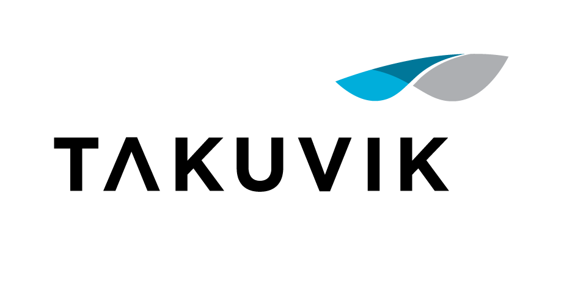
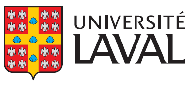
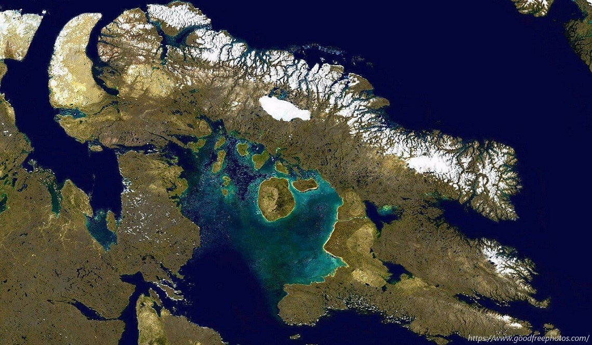
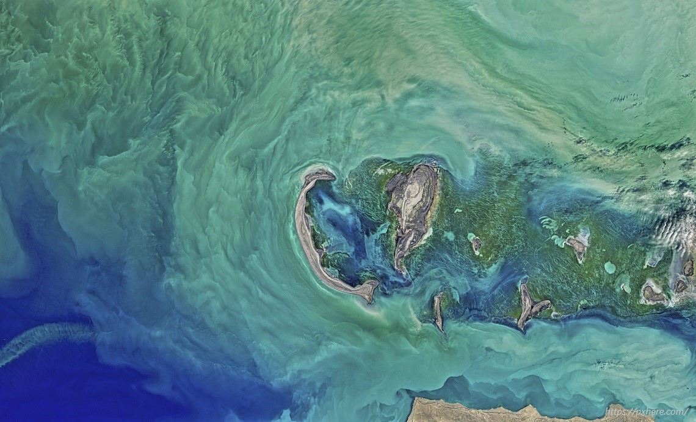

```{r setup, include=FALSE}
options(htmltools.dir.version = FALSE)
knitr::opts_chunk$set(
  fig.width = 5, 
  fig.height = 3.5,
  fig.align = "center",
  dev = "png",
  dpi = 300,
  cache = FALSE,
  echo = FALSE,
  message = FALSE, 
  warning = FALSE,
  hiline = TRUE
)

knitr::knit_hooks$set(crop = knitr::hook_pdfcrop)

library(tidyverse)
library(ggpmthemes)
library(rnaturalearth)
library(sf)

theme_set(theme_minimal(base_family = "Montserrat"))

theme_update(
  panel.border = element_blank(),
  axis.ticks = element_blank()
)

```

```{r xaringan-themer, include=FALSE, warning=FALSE}
library(xaringanthemer)
style_mono_accent(
  base_color = "#203240",
  header_font_google = google_font("Patrick Hand"),
  text_font_google = google_font("Montserrat", "500", "500i"),
  code_font_google = google_font("Fira Mono"),
  text_font_size = "24px",
  base_font_size = "20px",
  text_color = "#d6bf61",
  background_color = "#203240",
  header_color = "#b25a56", 
  title_slide_text_color = "#d6bf61",
  text_bold_color = "#b25a56",
  text_bold_font_weight = 600, 
  inverse_background_color = "#232323"
)
```

```{css, echo=FALSE}
a {
  color: deepskyblue;
}

.column-left {
  width: 60%;
  float: left;
  padding-top: 1em;
  margin-right: 0em;
}

.column-right {
  width: 40%;
  float: right;
  padding-top: 0em;
}

.inverse h1{
	color: var(--inverse-header-color);
	font-size: 100px;
	/* font-size: "40em"; */
}

.inverse h2{
	color: var(--inverse-header-color);
	font-size: 70px;
	/* font-size: "40em"; */
}

```

<!-- https://open.canada.ca/data/en/dataset/1318c39f-74ca-4f8a-b81c-95e1694553eb -->

## Who am I

Research associate at the Takuvik Joint International Laboratory under the supervision of Dr. Marcel Babin.

<center>

</center>

<center>

</center>

---

## What I do

- I use `r fontawesome::fa("r-project", fill = "#9dadbc", height = "30px")` for my daily analysis.

- Data manipulation and wrangling.

- Exploratory data analysis and visualization.

- Explore data to answer concretes questions.

## Scientific interests

- Aquatic ecosystems (limnology & oceanography).

- Aquatic optic & remote sensing.

- Data science (multivariate analyses, spatial analyses, machine learning).

---

## Exploring the Arctic Ocean

Understanding ecosystems functioning using data collected at high temporal and spatial resolutions.

<center>
.pull-left[

<small><figcaption>©Guislain Bécu</figcaption></small>
]

.pull-right[

<small><figcaption>©Marie-Hélène Forget</figcaption></small>
]
</center>

---

## Remote sensing

Remote sensing provides information on the optical properties of water masses.

<br>

.pull-left[
<center>

</center>
]

.pull-right[
<center>

</center>
]

---

## Remote sensing

It is also a useful tool to monitor the effects of climate changes in the Arctic.

```{r, sic, cache = TRUE, out.width="60%", fig.align='center'}
file <- "ftp://sidads.colorado.edu/pub/DATASETS/NOAA/G02135/north/monthly/data/N_12_extent_v3.0.csv"

df <- read_csv(file) %>% 
  janitor::clean_names() %>% 
  filter(extent > 0)

df %>% 
  ggplot(aes(x = year, y = extent)) +
  geom_point() +
  geom_smooth(method = "lm") +
  labs(
    x = NULL,
    y = bquote("Sea ice extent" ~ (km^2 %*% 10^6)),
    title = "Sea ice extent in the Arctic in December",
    caption = "Data: https://nsidc.org/data/seaice_index/"
  ) +
  theme(
    plot.title = element_text(face = "bold", size = 16, hjust = 0.5),
    plot.title.position = "plot",
    plot.caption = element_text(color = "gray50", size = 8)
  )

```

---

```{r}
url <- "https://pacgis01.dfo-mpo.gc.ca/FGPPublic/Nunavut_Ringed_Seal_Monitoring/Nunavut_ringed_seal_monitoring.csv"

file <- curl::curl_download(url, tempfile())

df <- read_csv(file, locale = locale(encoding = "latin1")) %>%
  rename_with(.fn = ~str_remove(., "/.*"), everything()) %>% 
  janitor::clean_names() %>% 
  mutate(longitude_dd = parse_number(longitude_dd))
```

class: inverse, center, middle

## Nunavut ringed seal monitoring

<center>Mentoring opportunity: presentation of the data</center><br>

<center>
 
<small><figcaption>@ https://commons.wikimedia.org/</figcaption></small>
</center>

---

## Monitoring of the ringed seal population in the Arctic

```{r, map_plot, fig.height=5, out.width="55%", crop = TRUE}
canada <- ne_countries(country = "Canada", scale = "large", returnclass = "sf")

# crsuggest::suggest_crs(canada)

locations_sf <- df %>% 
  distinct(longitude_dd, latitude_dd) %>% 
  st_as_sf(coords = c("longitude_dd", "latitude_dd"), crs = 4326)

ggplot() +
  geom_sf(data = canada, size = 0.1, inherit.aes = FALSE, color = "#203240") +
  geom_sf(data = locations_sf, color = "red", size = 3) +
  coord_sf(crs = 3979) +
  scale_x_continuous(breaks = seq(-180, 180, by = 10)) +
  scale_y_continuous(breaks = seq(0, 90, by = 5)) +
  theme(
    panel.grid = element_line(size = 0.1, color = "gray75"),
    panel.background = element_rect(fill = "#203240", color = "transparent"),
    plot.background = element_rect(fill = "#203240", color = "transparent"),
    panel.border = element_blank(),
    axis.text = element_text(color = "gray50")
  )
```

---

## Overview of the data

Data from the Government of Canada: contains a total of **`r nrow(df)` observations collected between 1990 and 2015** across 16 communities. 

.column-left[
```{r}
df %>%
  head(10) %>%
  select(
    -c(
      longitude_dd,
      latitude_dd,
      spring_printemps,
      population,
      open,
      autumn,
      community_name,
      code,
      fat,
      nao
    )
  ) %>%
  knitr::kable() %>% 
  kableExtra::kable_styling(full_width = FALSE) %>% 
  kableExtra::row_spec(0:10, background = "#3c3c3c") %>% 
  kableExtra::row_spec(0:10, font_size = 14) %>% 
  kableExtra::row_spec(0, color = "#B25A56")
```
]

.column-right[
```{r, ref.label="map_plot", out.width="100%", crop = F}
```
]

---

## Possible questions

--

- Are there any **temporal changes** in the ringed seal population in the Nunavut?

--

- Can we link the population dynamic with environmental variables?

  - Water and air temperature

  - Sea ice concentration (from satellite imagery)

  - Water pollutants

--

- Influence of fisheries (standing stock and food resources)

---

class: inverse, center, middle

# If this data is not motivating you!

---

## Working with different data

- I am open to working with any kind of data (to the best of my knowledge). 

- Can be related to (*but not limited*): 

  - Environmental sciences
  
  - Your master/Ph.D. project
  
  - Any other fun datasets

---

## Data project advices

Ideally, the data for your project should have these properties:

--

- Passionate you!

  - **Finding your dataset can be an interesting/formative experience!**
  
  - I encourage you to find your own data. 
  
  - If you do not have ideas, we can brainstorm together.
  
--

- Large enough to practice your **data cleaning**, **data visualization** and **modeling** skills.

---

## How to reach me

`r fontawesome::fa("github", fill = "#9dadbc", height = "20px")` <small><font color="#9dadbc">  github.com/PMassicotte</font></small> <br>

`r fontawesome::fa("envelope", fill = "#9dadbc", height = "20px")`  <small><font color="#9dadbc">philippe.massicotte@takuvik.ulaval.ca</font></small> <br>

`r fontawesome::fa("twitter", fill = "#9dadbc", height = "20px")` <small><font color="#9dadbc">@philmassicotte</font></small> <br>

`r fontawesome::fa("blog", fill = "#9dadbc", height = "20px")` <small><font color="#9dadbc">www.pmassicotte.com</font></small>
